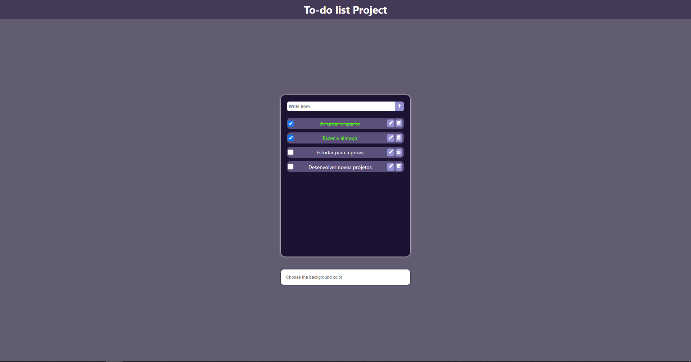

 

  

  <h3 align="center">To-do List</h3>

  

    Organize suas tarefas diárias com este projeto.
  

  
Table of Contents

  <ol>
    <li>
      <a href="#preview">Preview</a>
    </li>
    <li>
      <a href="#sobre-o-projeto">Sobre o projeto</a>
    </li>
    <li>
      <a href="#como-funciona">Como funciona</a>
    </li>
    <li>
      <a href="#screenshots">Screenshots</a>
    </li>
  </ol>

## Preview
Vídeo de demonstração:  
https://drive.google.com/file/d/1GHiwwYt_jTbPcH8OCTrpdupxgWsDggV4/view?usp=sharing 

## Sobre o projeto
Eu desenvolvi este projeto com o intuito de treinar o básico do ReactJs. É uma simples lista de tarefas, na qual você pode organizar sua rotina, destacando afazeres que deve realizar ao longo do dia.  
Essa aplicação engloba todas as operações de um CRUD, sendo ótima para aprender e treinar ReactJS!

Benefícios desse aplicativo:
* Permite o planejamento de tarefas;
* Você pode editar e excluir o que colocar ☺️;

## Como funciona
<ol>
    O usuário pode realizar cinco ações dentro do aplicativo:
    <ol>
      <li>
        Criar uma tarefa.
      </li>
      <li>
        Marcar a tarefa como concluída.
      </li>
      <li>
        Editar a tarefa criada.
      </li>
      <li>
        Excluir a tarefa criada.
      </li>
      <li>
        Mudar a cor de fundo do aplicativo.
      </li>
    </ol>
  
   
  <li>
    Para criar uma nova instância, o usuário deve escrever no input a tarefa que ele deseja salvar na lista. Após isso, basta clicar no botão com o símbolo de "mais". Dessa forma, uma nova tarefa será criada e mostrada na lista.
  </li>
   
  <li>
    Depois de ter criado uma instância, o usuário pode marcar a tarefa como concluída. Para isso, deve clicar na checkbox que fica no canto esquerdo. Quando uma tarefa está com sua checkbox marcada, a cor do texto é modificada e uma linha é passada, indicando que aquela tarefa foi realizada.
  </li>
   
  <li>
    Para editar uma tarefa, o usuário deve clicar no botão com o ícone de um lápis. Ao clicar no botão de editar, a instância é removida temporariamente da lista e o texto é mostrado no input. O input ficará com sua cor de fundo alterada, indicando que o texto está sendo editado. Após editar a tarefa, o usuário deve clicar no botão de criar novamente.
  </li>
   
  <li>
    Para excluir uma instância, o usuário deve clicar no botão com o ícone de uma lixeira.
  </li>
   
  <li>
    Para trocar a cor de fundo do aplicativo, o usuário deve escrever uma cor no input da parte inferior. 
  </li>
</ol>
 

Fique à vontade para me contatar!

## Screenshots
 
